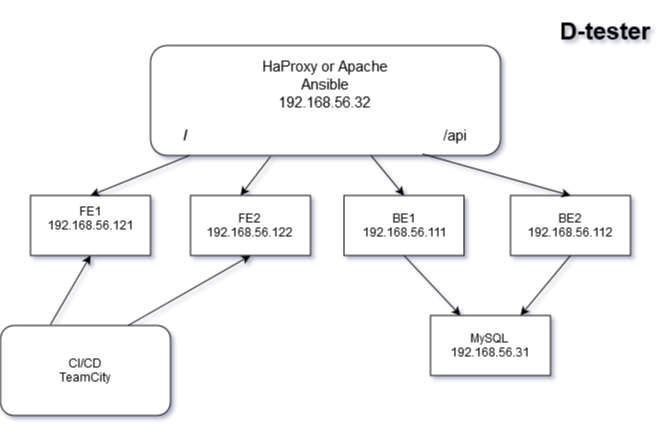

# Task 1. HaProxy, LAMP, Vagrant, Ansible, D-Tester

Scheme of our Environment


### Have been installed and configured by Vagrant, Ansible, Bash.
##### `note:` you can scalable count of virtual mashin for Front-end and Back-end via change variables `num_of_be`, `num_of_fe` in Vagrantfile.

### Data Base
mysql  Ver 8.0 ( (CentOS/8))

### Back-end 
- D-Tester API -- [https://github.com/yurkovskiy/dtapi](https://github.com/yurkovskiy/dtapi)
- Apache/2.4.6 (CentOS/7)
- PHP 7.3.21 + modules
- Koseven [https://github.com/koseven/koseven](https://github.com/koseven/koseven)
### Front-end 
 - [https://github.com/yurkovskiy/IF-105.UI.dtapi.if.ua.io](https://github.com/yurkovskiy/IF-105.UI.dtapi.if.ua.io)
 - Apache/2.4.6 (CentOS/7)
 
 For install without CI/CD server
 -- Node 12.18.x
 -- Angular CLI: 10.0.6
### Balancer
- haproxy 1.5.18
- Config `https`
 
# Start 
If you have installed [VirtualBox](https://www.virtualbox.org/). 
```  
Vagrant up

```  
